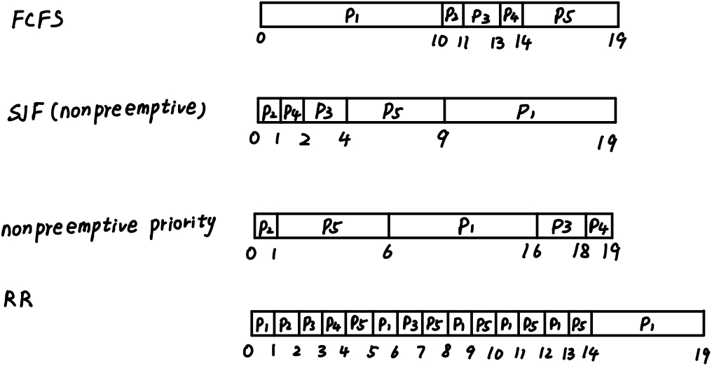
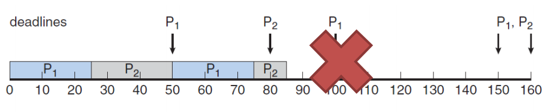
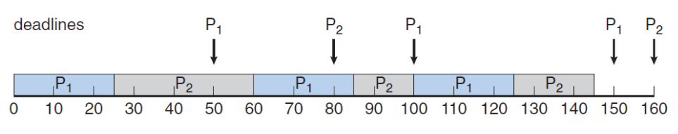

# 操作系统作业三

## 1.  List all the requirements of the entry and exit implementation when solving the critical-section problem. Analyze whether strict alternation satisfies all the requirements.

​	进入和退出临界区的要求：

- 1.`互斥`：不能同时有两个进程处于临界区
- 2.`速度`：每个进程以一定的速度运行，但是不对进程的速度做出任何假定
- 3.`进步`：不处于临界区的进程不能阻塞其它进程进入临界区
- 4.`有限等待`：进程不能一直等待进入临界区，等待次数或时间应有限

​	严格变更让两个进程交替进入临界区，可以满足互斥、速度、有限等待的要求。但不满足进步，它限制了两个进程交替进入临界区，这阻止了一个进程连续两次进入临界区，当进程1刚从临界区退出，进程2不在临界区，进程1想进入临界区时只能等待进程2进入临界区再从临界区退出，这使得不在临界区的进程2阻塞了进程1，不满足进步的要求。

## 2. For Peterson’s solution, prove that it satisfies the three requirements of a solution for the critical section problem.

- 1.`互斥`：当`turn!=other`或者`interested[other]==false`时进程才能进入临界区，若两个进程同时进入临界区，那么两个进程的`interested[other]`都为`ture`，而`turn`只有一个值，不可能两个进程的`turn!=other`同时满足，因此满足互斥
- 2.`进步`：当另一个进程不需要进入临界区时，`interested[other]==false`，进程不会被阻塞，满足进步条件
- 3.`有限等待`：当进程想要进入临界区时，会先让另一个进程进入临界区，这样不会有进程无限等待下去，满足有限等待条件。

## 3.What is deadlock? List the four requirements of deadlock.

​	在多道程序环境中，多个进程可以竞争有限数量的资源。当一个进程申请资源时，如果这时没有可用资源，那么这个进程进入等待状态，如果所申请的资源被其它也在等待的进程占有，那么该等待进程可能再也无法改变状态，这种情况称为死锁。

​	死锁的四个要求：

- 1.互斥：一个资源一次只能被一个进程所使用
- 2.占有并等待：一个进程应至少占有一个资源并在等待被其它进程所占有的资源
- 3.非抢占：资源只能在进程执行结束后被进程自愿释放
- 4.循环等待：有一组等待进程{P0，P1，……Pn}，P0等待的资源为P1占有，P1等待的资源为P2占有，……，Pn-1等待的资源为Pn占有，Pn等待的资源为P0占有

## 4.Consider the following snapshot of a system: Using the banker’s algorithm, determine whether or not each of the following states is unsafe. If the state is safe, illustrate the order in which the threads may complete. Otherwise, illustrate why the state is unsafe.a. Available = (2, 2, 2, 3) b. Available = (4, 4, 1, 1) c. Available = (3, 0, 1, 4) d. Available = (1, 5, 2, 2).

- a.安全，线程完成的顺序是T4，T0，T1，T2，T3
- b.安全，线程完成的顺序是T2，T4，T1，T0，T3
- c.不安全，B资源无法满足任何线程的需求，导致死锁
- d.安全，线程完成的顺序是T3，T1，T2，T0，T4

##  5. What is semaphore? Explain the functionalities of semaphore in process synchronization. 

​	信号量是一种数据类型，只能通过两个原子操作`down()`和`up()`进行访问，用于解决同步问题。

​	在进程同步中，信号量分为两种，计数信号量和二进制信号量。计数信号量可以用于控制访问具有多个实例的某种资源，信号量的初值为可用资源数量，当进程需要使用资源时，使用`wait()`减少信号量的计数，当进程释放资源时，使用`signal()`增加信号量的计数，当信号量的计数为0时，所有的资源都被使用，此时需要使用资源的进程调用wait()会被阻塞。二进制信号量的值只能为0和1，可以用来提供互斥。

## 6. Please use semaphore to provide a deadlock-free solution to address the dining philosopher problem.

`state`数组用于判断两边的哲学家是否在进餐，信号量`mutex`用于保证对`state`数组的原子操作，信号量数组`s[N]`用来在两边哲学家进餐时阻塞当前哲学家进餐，而当两边正在进餐的哲学家进餐完毕后，会调用`test()`，使得该哲学家可以进餐

```c++
#define N 5
#define LEFT ((i+N-1) % N)
#define RIGHT ((i+1) % N)
#define HUNGRY 0
#define EATING 1

//以下三个变量是各线程共享的
int state[N];
semaphore mutex = 1;
semaphore s[N];

//判断是否左右两个哲学家处于EATING状态
void test(int i) {
	if(state[i] == HUNGRY && state[LEFT] != EATING && state[RIGHT] != EATING) {
		state[i] = EATING;
		up(&s[i]);
	}
}

//拿起筷子
void take(int i) {
	down(&mutex);
	state[i] = HUNGRY;
	test(i);
	up(&mutex);
	down(&s[i]);
}

//放下筷子
void put(int i) {
	down(&mutex);
	state[i] = THINKING;
	test(LEFT);
	test(RIGHT);
	up(&mutex);
}

//各线程的主函数
void philosopher(int i) {
	think();
	take(i);
	eat();
	put(i);
}
```

## 7. Consider the following set of processes, with the length of the CPU burst time given in milliseconds: The processes are assumed to have arrived in the order P1, P2, P3, P4, P5, all at time 0. a) Draw four Gantt charts that illustrate the execution of these processes using the following scheduling algorithms: FCFS, SJF (nonpreemptive), nonpreemptive priority (a smaller priority number implies a higher priority), and RR (quantum = 1). b) What is the turnaround time of each process for each of the scheduling algorithms in part a? c) What is the waiting time of each process for each of these scheduling algorithms? d) Which of the algorithms results in the minimum average waiting time (over all processes)? e) Illustrate the pros and cons of the algorithms: FCFS, SJF, priority scheduling and RR.

​	(a)



​	(b) 

| Process | FCFS | SJF(nonpreemptive) | nonpreemptive priority |  RR  |
| :-----: | :--: | :----------------: | :--------------------: | :--: |
|   P1    |  10  |         19         |           16           |  19  |
|   P2    |  11  |         1          |           1            |  2   |
|   P3    |  13  |         4          |           18           |  7   |
|   P4    |  14  |         2          |           19           |  4   |
|   P5    |  19  |         9          |           6            |  14  |

​	(c)

| Process | FCFS | SJF(nonpreemptive) | nonpreemptive priority |  RR  |
| :-----: | :--: | :----------------: | :--------------------: | :--: |
|   P1    |  0   |         9          |           6            |  9   |
|   P2    |  10  |         0          |           0            |  1   |
|   P3    |  11  |         2          |           16           |  5   |
|   P4    |  13  |         1          |           18           |  3   |
|   P5    |  14  |         4          |           1            |  9   |

​	(d) SJF(nonpreemptive)

​	(e)

- FCFS：优点是算法容易实现，缺点是平均等待时间往往很长，进程的到达顺序对调度效果的影响很大

- SJF(nonpreemptive)：优点是拥有最小的平均等待时间，缺点是在实际中难以知道进程预期的CPU执行时间
- nonpreemptive priority：优点是可以通过任意实现给定的优先级决定执行的顺序，缺点是可能导致无穷阻塞
- RR：优点是有好的响应性和公平性，适用于分时系统，可以让每个进程都得到执行的机会，缺点是需要很多次的上下文切换

## 8. Illustarte the key ideas of rate-monotonic scheduling and earliest deadline-first scheduling. Give an example to illustrate under what circumstances rate-monotonic scheduling is inferior to earliest-deadline-first scheduling in meeting the deadlines associated with processes? 

​	假定调度进程是周期性的，具有固定的`处理时间t`和`周期p`

​	`单调速率调度`采用抢占的、静态优先级的策略，每个任务会分配一个与周期成反比的静态优先级，理由是更频繁地需要CPU的任务应该分配更高的优先级

​	`最早截止期限优先调度`根据截止期限动态分配优先级，截止期限越早，优先级越高。

​	例如当进程P1具有周期p1=50和处理时间t1=25，进程P2具有周期p2=80和处理时间t2=35

​	`单调速率调度`不能满足截止时间



​	`最早截止期限优先调度`可以满足截止时间


